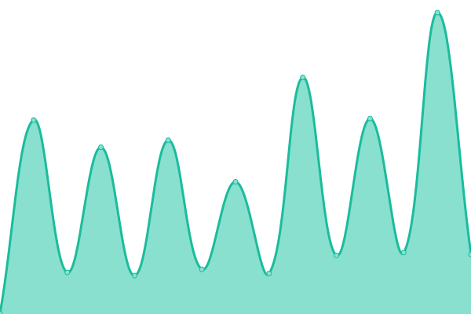

# [📈 Live Status](https://demo.upptime.js.org): <!--live status--> **🟧 Partial outage**

This repository contains the open-source uptime monitor and status page for our little community sites.

With [Upptime](https://upptime.js.org), you can get your own unlimited and free uptime monitor and status page, powered entirely by a GitHub repository. We use [Issues](https://github.com/m1rc0/starfleetuptime/issues) as incident reports, [Actions](https://github.com/m1rc0/starfleetuptime/actions) as uptime monitors, and [Pages](https://demo.upptime.js.org) for the status page.

<!--start: status pages-->
<!-- This summary is generated by Upptime (https://github.com/upptime/upptime) -->
<!-- Do not edit this manually, your changes will be overwritten -->
<!-- prettier-ignore -->
| URL | Status | History | Response Time | Uptime |
| --- | ------ | ------- | ------------- | ------ |
|  [Wardenburg Social Mastodon](https://masto.wardenburg.social) | 🟥 Down | [wardenburg-social-mastodon.yml](https://github.com/m1rc0/starfleetuptime/commits/HEAD/history/wardenburg-social-mastodon.yml) | 

 424ms
     
 | 

<a href="https://uptime.wardenburg.social/history/wardenburg-social-mastodon">100.00%</a>
    

|  [Wardenburg Social PeerTube](https://tube.wardenburg.social) | 🟥 Down | [wardenburg-social-peer-tube.yml](https://github.com/m1rc0/starfleetuptime/commits/HEAD/history/wardenburg-social-peer-tube.yml) | 

 1558ms
     
 | 

<a href="https://uptime.wardenburg.social/history/wardenburg-social-peer-tube">100.00%</a>
    

|  [Wardenburg Social Synapse (Matrix) Server](https://matrix.ocrim.de) | 🟥 Down | [wardenburg-social-synapse-matrix-server.yml](https://github.com/m1rc0/starfleetuptime/commits/HEAD/history/wardenburg-social-synapse-matrix-server.yml) | 

 7450ms
     
 | 

<a href="https://uptime.wardenburg.social/history/wardenburg-social-synapse-matrix-server">100.00%</a>
    

|  [Wardenburg Social Nextcloud](https://cloud.wardenburg.social) | 🟥 Down | [wardenburg-social-nextcloud.yml](https://github.com/m1rc0/starfleetuptime/commits/HEAD/history/wardenburg-social-nextcloud.yml) | 

 4145ms
     
 | 

<a href="https://uptime.wardenburg.social/history/wardenburg-social-nextcloud">100.00%</a>
    

|  [Wardenburg Social PeerTube](https://tube.wardenburg.social) | 🟥 Down | [wardenburg-social-peer-tube.yml](https://github.com/m1rc0/starfleetuptime/commits/HEAD/history/wardenburg-social-peer-tube.yml) | 

 1558ms
     
 | 

<a href="https://uptime.wardenburg.social/history/wardenburg-social-peer-tube">100.00%</a>
    

|  [Wardenburg Social Viewtube](https://watch.wardenburg.social/) | 🟥 Down | [wardenburg-social-viewtube.yml](https://github.com/m1rc0/starfleetuptime/commits/HEAD/history/wardenburg-social-viewtube.yml) | 

 451ms
     
 | 

<a href="https://uptime.wardenburg.social/history/wardenburg-social-viewtube">100.00%</a>
    

|  [Wardenburg Social Search](https://search.wardenburg.social/) | 🟩 Up | [wardenburg-social-search.yml](https://github.com/m1rc0/starfleetuptime/commits/HEAD/history/wardenburg-social-search.yml) | 

 7627ms
     
 | 

<a href="https://uptime.wardenburg.social/history/wardenburg-social-search">100.00%</a>
    

<!--end: status pages-->

[**Visit our status website →**](https://demo.upptime.js.org)

## 📄 License

- Powered by: [Upptime](https://github.com/upptime/upptime)
- Code: [MIT](./LICENSE) © [Mirco](https://demo.upptime.js.org)
- Data in the `./history` directory: [Open Database License](https://opendatacommons.org/licenses/odbl/1-0/)
